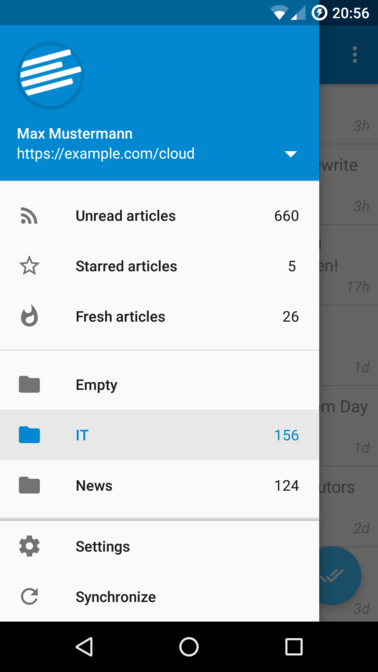
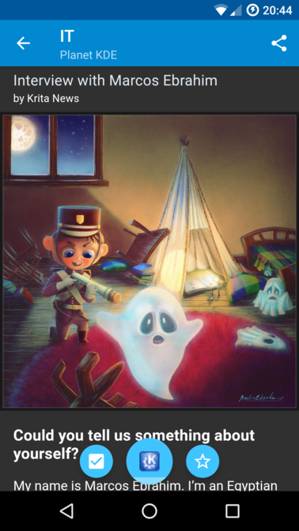

# [OCReader][1] - Android client for [Nextcloud News][0]

OCReader is a client for a [Nextcloud News][0] instance (needs at least version 8.8.2).

## Screenshots

### Dark theme

## License
OCReader is released under the [GNU General Public License version 3](https://www.gnu.org/licenses/gpl-3.0) (or later versions).

[TextDrawable](https://github.com/amulyakhare/TextDrawable) licensed under the MIT License, Copyright (c) 2014 Amulya Khare

## Contact
Maintainer: [Daniel Schaal](https://github.com/schaal) <<daniel@schaal.email>>

[0]: https://github.com/nextcloud/news
[1]: https://github.com/schaal/ocreader
